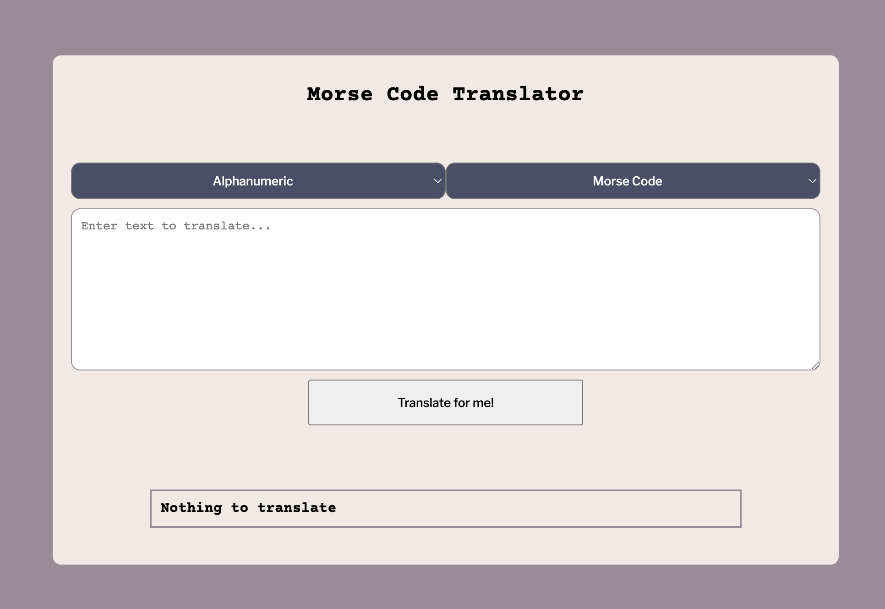
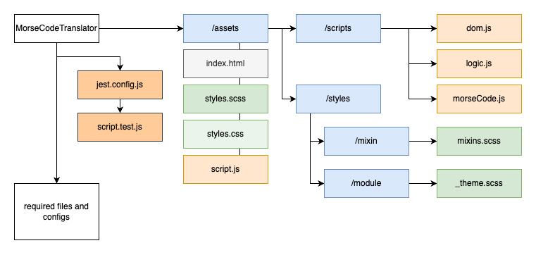

# Morse Code Translator


## Demo & Snippets

-   [Live view](https://rianns.github.io/MorseCodeTranslator/) |
    [Github](https://github.com/rianns/MorseCodeTranslator.git)
-   

---

## Requirements / Purpose

### MVP

-   Create a user interface that allows the user to either input some English
    text or some Morse Code

-   Create JS functions that would allow the user to:

    -   translate their English text into Morse Code
    -   Morse Code into English text
    -   Make sure to handle spaces properly (ie. there is 1 space between
        English words, but one space between Morse Code characters)

-   Split your code between data, logic functions and dom functions
-   Develop unit tests for all of your logic functions
-   Explore and discover edge cases in your code to further develop your tests

-   Bonus: Handle other characters as well
-   Bonus: Detect if a piece of text is english or morse and translate
    accordingly

### Purpose

-   Show consolidated knowledge and application of HTML, CSS, JS and the
    document object model (DOM) manipulation.
-   Apply testing using JestJS for logic validation and unit testing

### stack used and why

-   HTML
-   SCSS/CSS
-   JavaScript

---

## Build Steps



### Required installations and dependencies

-   SASS for CSS
-   JestJS
-   Babel

### Build

1. Set up application structure using the image shown above.
2.

### Theme

Colour

```scss
$primary-color-bg: #f2e9e4;
$secondary-color-bg: #9a8c98;
$tertiary-color-accent: #4a4e69;

$primary-color-text: #22223b;
$secondary-color-text: #4a4e69;
```

Font style

```scss
$main-font-family: "Courier Prime", monospace;
$secondary-font-family: "Libre Franklin", sans-serif;
```

---

## Design Goals / Approach

-   My main design goal for this project was having simple working translator
    with a colour scheme that I do not always interact with in an effort to
    expand my horizons with colours.

---

## Features

-   Translate from Alphanumeric characters to Morse Code (and vice versa)
-   View translation history

---

## Known issues

-   Drop down for languages break when the same language is chosen
    -   e.g. (Morse Code -> Morse Code)
-   translation results into an empty string if wrong combination of languages
    are set
    -   e.g. (Morse Code -> Alphanumeric)
        -   result: empty string, no error
-   pressing Enter/Return after typing in text area behaves unexpectedly
    -   should handle a form submit, instead of putting the typing cursor in the
        next line

---

## Future Goals

-   on change translation when live typing
-   automatically select a different language on the [to language] drop down if
    languages chosen on [from language] is the same
    -   e.g. (Alphanumeric) on left drop down automatically sets right drop down
        to (Morse Code)

---

## Change logs

### 11/04/2023 - Initial commit

-   added working translator
-   added live version of translator

---

## What did you struggle with?

-   I had struggled with separating DOM manipulation with the logic codes in JS.
    I think I had a preferred method of setting up my modules. Even though the
    codes were working fine because this application is quite small in
    magnitude, if the application were to get bigger, adding more
    languages/characters, my methods would have made extremely unreadable code.

---

## Licensing Details

-   No license

---

## Further details, related projects, reimplementations

-   This is the initial release of this project.
